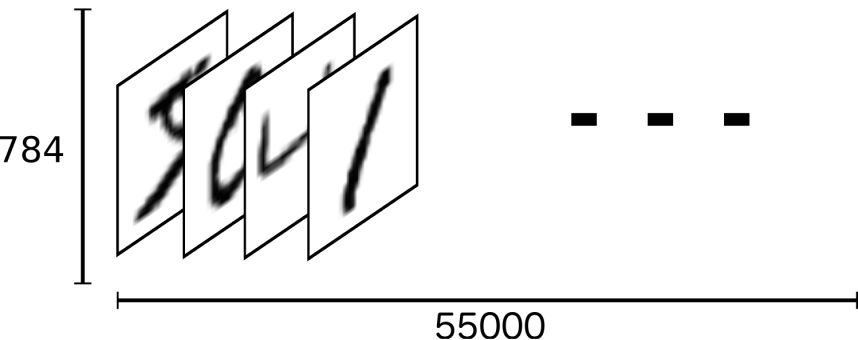
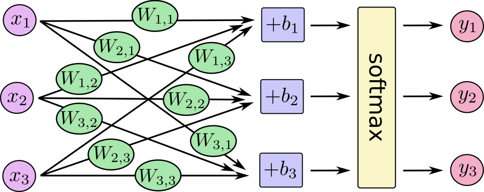
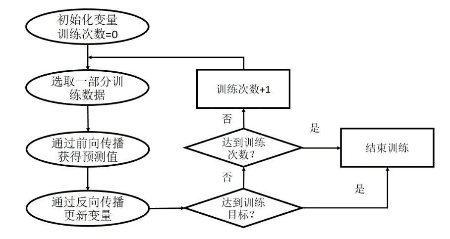
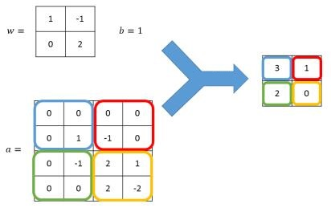
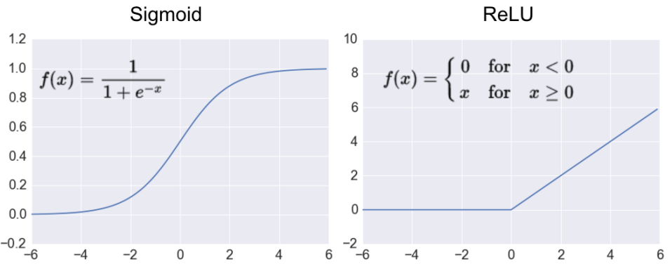
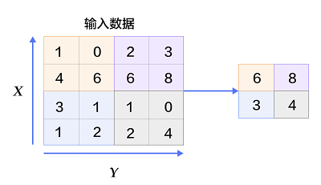

**TensorFlow入门**

1.  **前言**

深度学习算法的成功使人工智能的研究和应用取得了突破性进展，并极大地改变了我们的生活。越来越多的开发人员都在学习深度学习方面的开发技术。Google推出的TensorFlow是目前最为流行的开源深度学习框架，在图形分类、音频处理、推荐系统和自然语言处理等场景下都有丰富的应用。尽管功能强大，该框架学习门槛并不高，只要掌握Python安装和使用，并对机器学习和神经网络方面的知识有所了解就可以上手。本文就带你来一趟TensorFlow的启蒙之旅。

1.  **初识TensorFlow**

    1.  **TensorFlow安装说明**

>   我们先来安装TensorFlow。TensorFlow对环境不算挑剔，在Python
>   2.7和Python3下面均可运行，操作系统Linux、MAC、Windows均可（注意新版本刚出来时可能只支持部分操作系统），只要是64位。安装TensorFlow主要不同之处是TensorFlow安装包分支持GPU和不支持GPU两种版本，名称分别为tensorflow-gpu和tensorflow。实际生产环境最好安装支持GPU的版本，以利于GPU强大的计算能力，不过这需要先安装相应的CUDA
>   ToolKit和CuDNN。相比之下，安装不支持GPU的TensorFlow包容易些，顺利的话执行一句pip
>   install
>   tensorflow就OK。如果读者在安装中遇到问题，可根据错误提示在网上搜索解决办法。

安装后，可在命令行下启动Python或打开Jupyter
Notebook，执行下面的语句验证TensorFlow是否安装成功。

>   \>\>\>import tensorflow as tf

用tf引用TensorFlow包已成为一种约定。在本文的所有示例代码中，均假定已事先执行该语句。

1.  **TensorFlow计算模型**

我们先来看在TensorFlow中如何计算c = a + b。这里a = 3，b = 2。

>   \>\>\>a = tf.constant (3)

>   \>\>\>b = tf.constant (2)

>   \>\>\>c = a + b

>   \>\>\>sess = tf.Session ()

>   \>\>\>print (sess.run(c))

>   5

从上面的代码可以看出，比起Python中的一句print
(3+2)，TensorFlow中实现同样的功能需要更多的步骤。首先得把参数打包，再交给Session对象执行才能输出结果。

现在我们对代码稍作修改，让程序输出更多的调试信息。

>   \>\>\>a = tf.constant (3)

>   \>\>\>b = tf.constant (2)

>   \>\>\>print (a, b)

>   Tensor("Const:0", shape=(), dtype=int32) Tensor("Const_1:0", shape=(),
>   dtype=int32)

>   \>\>\>c = a + b

>   \>\>\>print(c)

>   Tensor("add:0", shape=(), dtype=int32)

>   \>\>\>sess = tf.Session ()

>   \>\>\>sess.run ((a,b))

>   (3,2)

>   \>\>\>print(sess.run(c))

>   5

从上面可以看出，a、b、c都是张量（Tensor）而不是数字。张量的数学含义是多维数组。我们把1维数组称为向量，2维数组称为矩阵。而不管1维、2维、3维、4维，都可以称作张量，甚至标量（数字）也可以看作是0维的张量。在深度学习中，几乎所有数据都可以看作张量，如神经网络的权重、偏置等。一张黑白图片可以用2维张量表示，其中的每个元素表示图片上一个像素的灰度值。一张彩色图片则需要用3维张量表示，其中两个维度为宽和高，另一个维度为颜色通道。TensorFlow的名字中就含有张量（Tensor）这个词。另一个词Flow的意思是“流”，表示通过张量的流动来表达计算。TensorFlow是一个通过图（Graph）的形式来表述计算的编程系统，图中每个节点为一种操作（Operation），包括计算、初始化、赋值等。张量则为操作的输入和输出。如上面的c
= a + b为张量的加法操作，等效于c = tf.add (a,
b)，a和b是加法操作的输入，c是加法操作的输出。

把张量提交给会话对象（Session）执行，就可以得到具体的数值。即在TensorFlow中包含两个阶段，先以计算图的方式定义计算过程，再提交给会话对象，执行计算并返回计算结果。这是由于，TensorFlow的核心不是用Python语言实现的，每一步调用都需要函数库与Python之间的切换，存在很大开销。而且TensorFlow通常在GPU上执行，如果每一步都自动执行的话，则GPU把大量资源浪费在多次接收和返回数据上，远不如一次性接收返回数据高效。我们可以把TensorFlow的计算过程设想为叫外卖。如果我们到馆子里用餐，可以边吃边上菜。如果叫外卖的话，就得先一次性点好菜谱，再让对方把饭菜做好后打包送来，让送餐的多次跑路不太合适。

与sess.run (c)的等效的语句是c.eval (session =
sess)。作为对象和参数，张量和会话刚好调了个位置。如果上下文中只用到一个会话，则可用tf.InteractiveSession()创建默认的会话对象，后面执行计算时无需再指定。即：

>   \>\>\>a = tf.constant (3)

>   \>\>\>b = tf.constant (2)

>   \>\>\>c = a + b

>   \>\>\>sess = tf.InteractiveSession ()

>   \>\>\>print (c.eval())

>   5

另外，在先前的代码中，参数3和2被固化在代码中。如果要多次执行加法运算，我们可以用tf.placeholder代替tf.constant，而在执行时再给参数赋值。如下面的代码所示：

>   \>\>\>a = tf.placeholder(tf.int32)

>   \>\>\>b = tf.placeholder(tf.int32)

>   \>\>\>c = a + b

>   \>\>\> sess = tf.InteractiveSession()

>   \#下面的语句也可写成print (sess.run (c, {a:3, b:2}))

>   \>\>\>print (c.eval ({a:3, b:2}))

>   5

>   \>\>\>print (c.eval ({a:[1,2,3], b:[4,5,6]}))

>   [5 7 9]

另一种存储参数的方式是使用变量对象（tf.Variable）。与tf.constant函数创建的张量不同，变量对象支持参数的更新，不过这也意味着依赖更多的资源，与会话绑定得更紧。变量对象必须在会话对象中明确地被初始化，通常调用tf.global_variables_initializer函数一次性初始化所有变量。

>   \>\>\>a = tf.Variable (3)

>   \>\>\>b = tf.Variable (2)

>   \>\>\>c = a + b

>   \>\>\>init = tf.global_variables_initializer()

>   \>\>\>sess = tf.InteractiveSession()

>   \>\>\>init.run()

>   \>\>\>print(c.eval())

>   5

>   \>\>\>a.load (7)

>   \>\>\>b.load (8)

>   \>\>\>print (c.eval())

>   15

在深度学习中，变量对象通常用于表示待优化的模型参数如权重、偏置等，其数值在训练过程中自动调整。这在本文后面的例子中可以看到。

1.  **TensorFlow机器学习入门**

    1.  **导入数据**

MNIST是一个非常有名的手写体数字识别数据集，常常被用作机器学习的入门样例。TensorFlow的封装让使用MNIST更加方便。现在我们就以MINIST数字识别问题为例探讨如何使用TensorFlow进行机器学习。

MNIST是一个图片集，包含70000张手写数字图片：

它也包含每一张图片对应的标签，告诉我们这个是数字几。比如，上面这四张图片的标签分别是5，0，4，1。

在下面的代码中，input_data.read_data_sets()函数下载数据并解压。

>   from tensorflow.examples.tutorials.mnist import input_data

>   \# MNIST_data为随意指定的存储数据的临时目录

>   mnist = input_data.read_data_sets("MNIST_data/", one_hot=True)

下载下来的数据集被分成3部分：55000张训练数据（minist.train）；5000张验证数据（mnist.validation）；10000张测试数据（mnist.test）。切分的目的是确保模型设计时有一个单独的测试数据集不用于训练而是用来评估这个模型的性能，从而更加容易把设计的模型推广到其他数据集上。

每一张图片包含$$28 \times 28$$个像素点。我们可以用一个数字数组来表示一张图片：

数组展开为长度是$$28 \times 28 =
784$$的向量，则训练数据集mnist.train.images 是一个形状为 [60000,
784] 的张量。在此张量里的每一个元素，都表示某张图片里的某个像素的灰度，其值介于0和1之间。

MNIST数据集的标签是长度为10的one-hot向量（因为前面加载数据时指定了one_hot为True）。
一个one-hot向量除了某一位的数字是1以外其余各维度数字都是0。比如，标签3将表示成([0,
0, 0, 3, 0, 0, 0, 0, 0, 0, 0])。因此， mnist.train.labels 是一个 [55000,
10] 的数字矩阵。

1.  **设计模型**

现在我们通过训练一个叫做Softmax的机器学习模型来预测图片里的数字。回顾一下，分类和回归（数值预测）是最基本的机器学习问题。线性回归是针对回归问题最基本的机器学习模型，其基本思想是为各个影响因素分配合适的权重，预测的结果是各影响因素的加权和。逻辑（Logistic）回归则常用来处理分类问题，它在线性回归的基础上，通过Logistic函数（也称Sigmoid函数）把低于和高于参照值的结果分别转换为接近0和1的数值。不过逻辑回归只能处理二分问题。Softmax回归则是逻辑回归在多分类问题上的推广。整个模型如下图所示：

或者用线性代数公式表示为：

$$
y = \text{sof}\text{tmax}(\text{xW} + b)
$$

其中，*x*为输入数据的特征向量，向量的长度为图片的像素（$$28 \times 28 =
784$$），向量中的每个元素为图片上各点的灰度值，*W*为$$784 \times
10$$的权重矩阵，其中784对应于图片的像素，10对应于0 -
9这10个数字，*b*为长度为10的向量，向量中的每个元素为0 -
9各个数字的偏置，$$\text{xW} +
b$$得到各个数字的权重，最后softmax函数把权重转换为概率分布。通常我们最后只保留概率最高的那个数字，不过有时也关注概率较高的其他数字。

下面是TensorFlow中实现该公式的代码，核心代码为最后一句，其中tf.matmul函数表示Tensor中的矩阵乘法。注意与公式中略有不同的是，这里把x声明为2维的张量，其中第1维为任意长度，这样我们就可以批量输入图片进行处理。另外，为了简单起见，我们用0填充W和b。

>   x = tf.placeholder (tf.float32, [None, 784])

>   W = tf.Variable (tf.zeros([784, 10]))

>   b = tf.Variable (tf.zeros([10]))

>   y = tf.nn.softmax (tf.matmul (x, W) + b)

除了模型外，我们还需要定义一个指标来指示如何优化模型中的参数。我们通常定义指标来表示一个模型不尽人意的程度，然后尽量最小化这个指标。这个指标称为成本函数。成本函数与模型是密切相关的。回归问题一般用均方误差作成本函数，而对于分类问题，常用的成本函数是交叉熵（cross-entropy），定义为

$$
- \sum_{i}^{}{{y'}_{i}\mathrm{\log}(y_{i})}
$$

其中*y*是我们预测的概率分布，*y’*是实际的分布。对交叉熵的理解涉及信息论方面的知识，这里我们可以把它看作反映预测不匹配的指标，或者说该指标反映实际情况出乎预料的程度。注意交叉熵是非对称的。在TensorFlow中，交叉熵表示为下面的代码：

>   cross_entropy = -tf.reduce_sum (y\_ \* tf.log (y))

因为交叉熵一般会与Softmax回归一起使用，所以TensorFlow对这两个功能进行了统一封装，并提供了tf.nn.softmax_cross_entropy_with_logits函数。可以直接通过下面的代码来实现使用了Softmax回归之后的交叉熵函数。注意与公式中的*y*不同，代码中的y是Softmax函数调用前的值。最后调用tf.reduce_mean函数取平均值，因为图片是批量传入的，针对每张图片会计算出一个交叉熵。

>   y = tf.matmul (x, W) + b

>   cross_entropy = tf.reduce_mean (

>   tf.nn.softmax_cross_entropy_with_logits (labels = y_, logits = y))

1.  **设计优化算法**

现在我们需要考虑如何调整参数使成本函数最小，这在机器学习中称为优化算法的设计问题。笔者这里对TensorFlow实现优化的过程作一个简要的介绍，要知道优化算法从某种意义上讲比模型更重要。

TensorFlow是一个基于神经网络的深度学习框架。对于Softmax这样的模型，被当作是不含隐藏层的全连接神经网络。通过调整神经网络中的参数对训练数据进行拟合，可以使得模型对未知的样本提供预测的能力，表现为前向传播和反向传播（Backpropagation）的迭代过程。在每次迭代的开始，首先需要选取全部或部分训练数据，通过前向传播算法得到神经网络模型的预测结果。因为训练数据都是有正确答案标注的，所以可以计算出当前神经网络模型的预测答案与正确答案之间的差距。最后，基于预测值和真实值之间的差距，反向传播算法会相应更新神经网络参数的取值，使得在这批数据上神经网络模型的预测结果和真实答案更加接近。如下图所示：

TensorFlow支持多种不同的优化器，读者可以根据具体的应用选择不同的优化算法。比较常用的优化方法有三种：tf.train.GradientDescentOptimizer、tf.train.AdamOptimizer和tf.train.MomentumOptimizer。

>   train_step = tf.train.GradientDescentOptimizer (0.01).minimize
>   (cross_entropy)

在这里，我们要求TensorFlow用梯度下降算法（Gradient
Descent）以0.01的学习速率最小化交叉熵。梯度下降算法是一个简单的学习过程，TensorFlow只需将每个变量一点点地往使成本不断降低的方向移动。语句返回的train_step表示执行优化的操作（Operation），可以提交给会话对象运行。

1.  **训练模型**

现在我们开始训练模型，迭代1000次。注意会话对象执行的不是W、b也不是y，而是train_step。

>   for i in range(1000):

>   batch_xs, batch_ys = mnist.train.next_batch(100)

>   sess.run (train_step, feed_dict = {x: batch_xs, y_: batch_ys})

该循环的每个步骤中，我们都会随机抓取训练数据中的100个批处理数据点，然后我们用这些数据点作为参数替换之前的占位符来运行train_step操作。

使用一小部分的随机数据来进行训练被称为随机训练（stochastic training）-
在这里更确切的说是随机梯度下降训练。在理想情况下，我们希望用我们所有的数据来进行每一步的训练，因为这能给我们更好的训练结果，但显然这需要很大的计算开销。所以，每一次训练我们可以使用不同的数据子集，这样做既可以减少计算开销，又可以最大化地学习到数据集的总体特性。

1.  **评估模型**

到验证我们的模型是否有效的时候了。我们可以基于训练好的W和b，用测试图片计算出y，并取预测的数字与测试图片的实际标签进行对比。在Numpy中有个非常有用的函数argmax，它能给出数组中最大元素所在的索引值。由于标签向量是由0,
1组成，因此最大值1所在的索引位置就是类别标签。对y而言，最大权重的索引位置就是预测的数字，因为softmax函数是单调递增的。下面代码比较各个测试图片的预测与实际是否匹配，并通过均值函数计算正确率。

>   import numpy as np

>   output = sess.run (y, feed_dict = {x: mnist.test.images})

>   print (np.mean (np.argmax(output,1) == np.argmax(mnist.test.labels,1)))

我们也可以让TensorFlow来执行比较，这在很多时候更为方便和高效。TensorFlow中也有类似的argmax函数。

>   correct_prediction = tf.equal (tf.argmax(y,1), tf.argmax(y_,1))

>   accuracy = tf.reduce_mean (tf.cast(correct_prediction, "float"))

>   print (sess.run (accuracy, feed_dict = {x: mnist.test.images, y_:
>   mnist.test.labels}))

这个最终结果值应该大约是91%。完整的代码请参考https://github.com/tensorflow/tensorflow/blob/master/tensorflow/examples/tutorials/mnist/mnist_softmax.py，有少量修改。

1.  **TensorFlow深度学习入门**

    1.  **卷积神经网络介绍**

前面我们使用了单层神经网络。如果增加神经网络的层数，可以进一步提高正确率。不过，增加层数会使需要训练的参数增多，这除了导致计算速度减慢，还很容易引发过拟合问题。所以需要一个更合理的神经网络结构来有效地减少神经网络中参数个数。对于图像识别这类问题，卷积神经网络（CNN）是目前最为有效的结构。

卷积神经网络是一个层级递增的结构，其基本思想是从对像素、边缘的认识开始，再到局部形状，最后才是整体感知。在传统方法中，我们需要在分类前对图像进行预处理，如平滑、去噪、光照归一化等，从中提取角点、梯度等特征，而卷积神经网络把这一过程自动化。当然，神经网络是一个黑盒子，没有前面所提到的这些概念，它所提取的都是抽象意义上的特征，与人类理解的语意特征无法对应。况且经过多层变换，图片早已面目全非。另外卷积神经网络也可以用于图像识别以外的领域。不过为了浅显易懂，下文中仍然使用像素、颜色之类的日常用语。

卷积神经网络中特征识别的基本手段是卷积（Convolution）。我们可以理解为把图片进行特效处理，新图片的每个位置的像素值是原图片对应位置及相邻位置像素值的某种方式的叠加或取反，类似于Photoshop中的滤镜如模糊、锐化、马赛克什么的，TensorFlow中称为过滤器（Filter）。卷积的计算方式是相邻区域内像素的加权求和，用公式表示的话，仍是$$\text{xW}
+ b$$，不过计算限定在很小的矩形区域内。

由于卷积只针对图片的相邻位置，可保证训练后能够对于局部的输入特征有最强的响应。另外，不论在图像的什么位置，都使用同一组权重，相当于把过滤器当作手电筒在图片上来回扫描，这使图像内容在图片中的位置不影响判断结果。卷积网络的这些特点使它显著减少参数数量的同时，又能够更好的利用图像的结构信息，提取出图像从低级到复杂的特征，甚至可以超过人类的表现。

神经网络需要使用激活函数去除线性化，否则即便增加网络的深度也依旧还是线性映射，起不到多层的效果。与Softmax模型所使用的Sigmoid函数不同，卷积神经网络钟爱激活函数的是ReLU，它有利于反向传播阶段的计算，也能缓解过拟合。ReLU函数很简单，就是忽略小于0的输出，可以理解为像折纸那样对数据进行区分。注意在使用ReLU函数时，比较好的做法是用一个较小的正数来初始化偏置项，以避免神经元节点输出恒为0的问题。下图是Sigmoid和ReLU函数的对比。

除了卷积外，卷积神经网络通常还会用到降采样（downsampling或subsampling）。我们可以理解为把图片适当缩小，由此在一定程度上控制过拟合并减少图像旋转、扭曲对特征提取的影响，因为降采样过程中模糊了方向信息。卷积神经网络正是通过卷积和降采样，成功将数据量庞大的图像识别问题不断降维，最终使其能够被训练。降采样在卷积神经网络中通常被称为池化（Pooling），包括最大池化、平均池化等。其中最常见的是最大池化，它将输入数据分成不重叠的矩形框区域，对于每个矩形框的数值取最大值作为输出。如下图所示。

1.  **构建LeNet-5网络**

对卷积神经网络有了基本了解后，我们现在开始使用这种网络来处理MNIST数字识别问题。这里参照最经典的LeNet-5模型，介绍如何使用TensorFlow进行深度学习。LeNet-5的结构如下图所示。可以看出，LeNet-5中包含两次的卷积和降采样，再经过两次全连接并使用Softmax分类作为输出。

模型第一层是卷积层。输入是原始图片，尺寸为$$28 \times
28$$，颜色用灰度表示，因此数据类型为$$28 \times 28 \times
1$$，考虑到批量输入，数据应有4个维度。过滤器尺寸为$$5 \times
5$$，计算32个特征，因此权重*W*为$$5 \times 5 \times 1 \times
32$$的张量，偏置*b*为长度32的向量。另外，为确保输出的图片仍为$$28 \times
28$$大小，在对图片边缘的像素进行卷积时，我们用0补齐周边。

TensorFlow中，tf.nn.conv2d函数实现卷积层前向传播的算法。这个函数的前两个参数分别表示输入数据*x*和权重*W*，均为4个维度的张量，如前所述。在深层网络中，权重在初始化时应该加入少量的噪声来打破对称性以及避免0梯度，这里我们用tf.truncated_normal函数生成的随机量填充。函数的随后两个参数定义卷积的方式，包括过滤器在图像上滑动时移动的步长及填充方式。步长用长度为4的数组表示，对应输入数据的4个维度，实际上只需要调整中间两个数字，这里我们设置为[1,
1, 1,
1]，表示一个像素一个像素地移动。填充方式有“SAME”或“VALID”两种选择，其中“SAME”表示添加全0填充，“VALID”表示不添加。

下面的代码实现模型第一层：

>   x = tf.placeholder (tf.float32, [None, 784])

>   \# 这里使用tf.reshape函数校正张量的维度，-1表示自适应

>   x_image = tf.reshape (x, [-1, 28, 28, 1])

>   W_conv1 = tf.Variable (tf.truncated_normal ([5, 5, 1, 32], stddev = 0.1))

>   b_conv1 = tf.Variable (tf.constant (0.1, shape = [32]))

>   \#执行卷积后使用ReLU函数去线性化

>   h_conv1 = tf.nn.relu (tf.nn.conv2d(

>   x_image, W_conv1, strides = [1, 1, 1, 1], padding = 'SAME') + b_conv1)

模型第二层为降采样层。采样窗口尺寸为$$2 \times 2$$，不重叠，因此步长也是$$2
\times
2$$，采用最大池化，采样后图像的尺寸缩小为原来的一半。实现图片最大池化的函数是tf.nn.max_pool。它的参数与tf.nn.conv2d类似，只不过第二个参数设置的不是权重而是采样窗口的大小，用长度为4的数组表示，对应输入数据的4个维度。

>   h_pool1 = tf.nn.max_pool (h_conv1, ksize = [1, 2, 2, 1],

>   strides = [1, 2, 2, 1], padding = 'SAME')

模型第三层为卷积层。输入数据尺寸为$$14 \times
14$$，有32个特征，过滤器尺寸仍为$$5 \times
5$$，需计算64个特征，因此权重*W*的类型为$$5 \times 5 \times 32 \times
64$$，偏置*b*为长度64的向量。

>   W_conv2 = tf.Variable (tf.truncated_normal ([5, 5, 32, 64], stddev = 0.1))

>   b_conv2 = tf.Variable (tf.constant(0.1, shape = [64]))

>   \#执行卷积后使用ReLU函数去线性化

>   h_conv2 = tf.nn.relu (tf.nn.conv2d(

>   h_pool1, W_conv2, strides = [1, 1, 1, 1], padding = 'SAME') + b_conv2)

模型第四层为降采样层，与第二层类似。图像尺寸再次缩小一半。

>   h_pool2 = tf.nn.max_pool (h_conv2, ksize = [1, 2, 2, 1],

>   strides = [1, 2, 2, 1], padding = 'SAME')

模型第五层为全连接层。输入数据尺寸为$$7 \times
7$$，有64个特征，输出1024个神经元。由于是全连接，输入数据*x*和权重*W*都应为2维的张量。全连接参数较多，这里引入Dropout避免过拟合。Dropout在每次训练时随机禁用部分权重，相当于多个训练实例上取平均结果，同时也减少了各个权重之间的耦合。TensorFlow中实现Dropout的函数为tf.nn.dropout。该函数第二个参数表示每个权重不被禁用的概率。

>   W_fc1 = tf.Variable (tf.truncated_normal ([7 \* 7 \* 64, 1024], stddev =
>   0.1))

>   b_fc1 = tf.Variable (tf.constant (0.1, shape = [1024]))

>   \#把4维张量转换为2维

>   h_pool2_flat = tf.reshape (h_pool2, [-1, 7\*7\*64])

>   h_fc1 = tf.nn.relu (tf.matmul (h_pool2_flat, W_fc1) + b_fc1)

>   keep_prob = tf.placeholder (tf.float32)

>   h_fc1_drop = tf.nn.dropout (h_fc1, keep_prob)

模型最后一层为全连接加上Softmax输出，类似之前介绍的单层模型。

>   W_fc2 = tf.Variable (tf.truncated_normal ([1024, 10], stddev = 0.1))

>   b_fc2 = tf.Variable (tf.constant(0.1, shape = [10]))

>   y_conv = tf.matmul (h_fc1_drop, W_fc2) + b_fc2

>   cross_entropy = tf.reduce_mean(

>   tf.nn.softmax_cross_entropy_with_logits (labels = y_, logits = y_conv))

1.  **训练和评估模型**

为了进行训练和评估，我们使用与之前简单的单层Softmax模型几乎相同的一套代码，只是我们会用更加复杂的ADAM优化器来缩短收敛时间，另外在feed_dict中加入额外的参数keep_prob来控制Dropout比例。然后每100次迭代输出一次日志。

>   train_step = tf.train.AdamOptimizer (1e-4).minimize (cross_entropy)

>   correct_prediction = tf.equal (tf.argmax (y_conv, 1), tf.argmax (y_, 1))

>   accuracy = tf.reduce_mean (tf.cast (correct_prediction, tf.float32))

>   sess = tf.InteractiveSession()

>   sess.run (tf.global_variables_initializer())

>   for i in range(20000):

>   batch_xs, batch_ys = mnist.train.next_batch(50)

>   if i % 100 == 0:

>   train_accuracy = accuracy.eval (feed_dict = {

>   x: batch_xs, y_: batch_ys, keep_prob: 1.0})

>   print('step %d, training accuracy %g' % (i, train_accuracy))

>   train_step.run (feed_dict = {x: batch_xs, y_: batch_ys, keep_prob: 0.5})

>   print ('test accuracy %g' % accuracy.eval (feed_dict = {

>   x: mnist.test.images, y_: mnist.test.labels, keep_prob: 1.0}))

以上代码，在最终测试集上的准确率大概是99.2%。完整的代码请参考https://github.com/tensorflow/tensorflow/blob/master/tensorflow/examples/tutorials/mnist/mnist_deep.py，局部有修改。

1.  **总结**

在本文中，我们介绍了TensorFlow的基本用法，并以MNIST数据为例，基于Softmax模型和卷积神经网络分别讲解如何使用TensorFlow进行机器学习和深度学习。TensorFlow对深度学习提供了强大的支持，包含丰富的训练模型，还提供了TensorBoard、TensorFlow游乐场、TensorFlow
Debugger等可视化和调试等手段方便。限于篇幅，这里不一一介绍，详见TensorFlow的官方文档。深度学习是一名较新的技术，理论和实践中都有不少坑。不过只要多学多上手，相信能让TensorFlow成为您手中的利器。

参考资料：

1.  《TensorFlow：实战Google深度学习框架》 才云科技、郑泽宇、顾思宇著

2.  《面向机器智能的TensorFlow实践》 Sam Abrahams等著，段菲、陈澎译

3.  《你好，TensorFlow》 http://mp.weixin.qq.com/s/0qJmicqIxwS7ChTvIcuJ-g

4.  《TensorFlow白皮书》（译文） http://www.jianshu.com/p/65dc64e4c81f

5.  《卷积神经网络》 http://blog.csdn.net/celerychen2009/article/details/8973218

6.  《卷积神经网络入门学习》
    http://blog.csdn.net/hjimce/article/details/51761865
