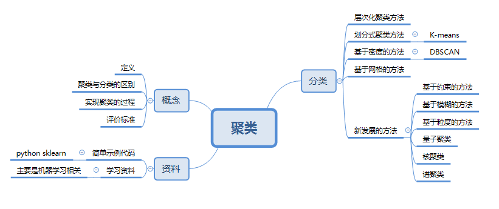
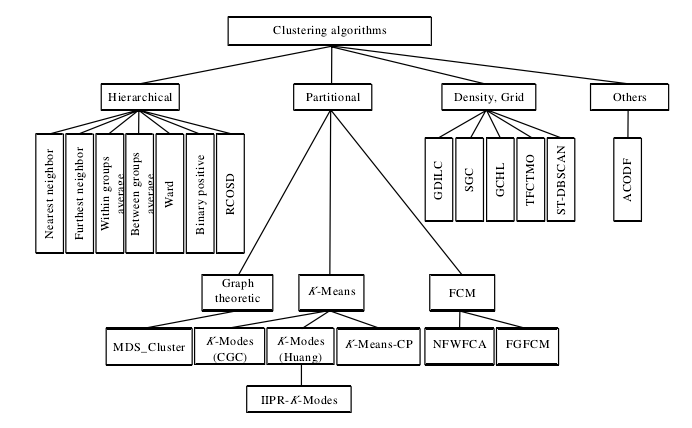

****一文读懂聚类****

***一  聚类的基本概念***  

**定义：**  
##聚类是数据挖掘中的概念，就是按照某个特定标准(如距离)把一个数据集分割成不同的类或簇，使得同一个簇内的数据对象的相似性尽可能大，同时不在同一个簇中的数据对象的差异性也尽可能地大。也即聚类后同一类的数据尽可能聚集到一起，不同类数据尽量分离。  

**聚类与分类的区别：**  
##Clustering (聚类)，简单地说就是把相似的东西分到一组，聚类的时候，我们并不关心某一类是什么，我们需要实现的目标只是把相似的东西聚到一起。因此，一个聚类算法通常只需要知道如何计算相似度就可以开始工作了，因此 clustering 通常并不需要使用训练数据进行学习，这在Machine Learning中被称作unsupervised learning (无监督学习)。  
##Classification (分类)，对于一个classifier，通常需要你告诉它“这个东西被分为某某类”这样一些例子，理想情况下，一个 classifier 会从它得到的训练集中进行“学习”，从而具备对未知数据进行分类的能力，这种提供训练数据的过程通常叫做supervised learning (监督学习)。  

**聚类过程：**  
(1)  数据准备:包括特征标准化和降维.   
(2)  特征选择:从最初的特征中选择最有效的特征,并将其存储于向量中.   
(3)  特征提取:通过对所选择的特征进行转换形成新的突出特征.  
(4)  聚类(或分组):首先选择合适特征类型的某种距离函数(或构造新的距离函数)进行接近程度的度量;   而后执行聚类或分组.   
(5)  聚类结果评估:是指对聚类结果进行评估.评估主要有 3 种:外部有效性评估、内部有效性评估和相关性测试评估.  

**衡量聚类算法优劣的标准：**  
（1）处理大的数据集的能力。  
（2）处理任意形状，包括有间隙的嵌套的数据的能力。  
（3）算法处理的结果与数据输入的顺序是否相关，也就是说算法是否独立于数据输入顺序。  
（4）处理数据噪声的能力。  
（5）是否需要预先知道聚类个数，是否需要用户给出领域知识。  
（6）算法处理有很多属性数据的能力，也就是对数据维数是否敏感。  

***二  聚类方法的分类***  
主要分为层次化聚类算法，划分式聚类算法，基于密度的聚类算法，基于网格的聚类算法，基于模型的聚类算法等。  

**层次化聚类算法：**  
又称树聚类算法，透过一种层次架构方式，反复将数据进行分裂或聚合。典型的有BIRCH算法，CURE算法，CHAMELEON算法，Sequence data rough clustering算法,Between groups average算法,Furthest neighbor算法,Neares neighbor算法等。  
典型凝聚型层次聚类：  
先将每个对象作为一个簇，然后合并这些原子簇为越来越大的簇，直到所有对象都在一个簇中，或者某个终结条件被满足。  
算法流程：  
(1) 将每个对象看作一类，计算两两之间的最小距离；  
(2) 将距离最小的两个类合并成一个新类；  
(3) 重新计算新类与所有类之间的距离；  
(4) 重复(2)、(3)，直到所有类最后合并成一类。  

**划分式聚类算法：**  
预先指定聚类数目或聚类中心，反复迭代逐步降低目标函数误差值直至收敛，得到最终结果。K-means,K-modes-Huang,K-means-CP,MDS_CLUSTER,	Feature weighted fuzzy clustering，CLARANS等
经典K-means算法流程:   
(1)随机地选择k个对象，每个对象初始地代表了一个簇的中心;  
(2)对剩余的每个对象，根据其与各簇中心的距离，将它赋给最近的簇;  
(3)重新计算每个簇的平均值，更新为新的簇中心。  
(4)不断重复(2) - (3)，直到准则函数收敛。  

**基于模型的聚类算法：**  
为每簇假定了一个模型，寻找数据对给定模型的最佳拟合，同一”类“的数据属于同一种概率分布，即假设数据是根据潜在的概率分布生成的。主要有基于统计学模型的方法和基于神经网络模型的方法，尤其以基于概率模型的方法居多。一个基于模型的算法可能通过构建反应数据点空间分布的密度函数来定位聚类。基于模型的聚类试图优化给定的数据和某些数据模型之间的适应性。  
SOM神经网络算法：该算法假设在输入对象中存在一些拓扑结构或顺序，可以实现从输入空间(n维)到输出平面(2维)的降维映射，其映射具有拓扑特征保持性质,与实际的大脑处理有很强的理论联系。  
SOM网络包含输入层和输出层。输入层对应一个高维的输入向量，输出层由一系列组织在2维网格上的有序节点构成，输入节点与输出节点通过权重向量连接。学习过程中，找到与之距离最短的输出层单元，即获胜单元，对其更新。同时，将邻近区域的权值更新，使输出节点保持输入向量的拓扑特征。  
算法流程：  
(1) 网络初始化，对输出层每个节点权重赋初值；  
(2) 将输入样本中随机选取输入向量，找到与输入向量距离最小的权重向量；  
(3) 定义获胜单元，在获胜单元的邻近区域调整权重使其向输入向量靠拢；  
(4) 提供新样本、进行训练；  
(5) 收缩邻域半径、减小学习率、重复，直到小于允许值，输出聚类结果。  

**基于密度聚类算法:**  
主要思想：只要邻近区域的密度（对象或数据点的数目）超过某个阈值，就继续聚类  
擅于解决不规则形状的聚类问题，广泛应用于空间信息处理,SGC,GCHL，DBSCAN算法、OPTICS算法、DENCLUE算法.  
DBSCAN：  
对于集中区域效果较好，为了发现任意形状的簇，这类方法将簇看做是数据空间中被低密度区域分割开的稠密对象区域；一种基于高密度连通区域的基于密度的聚类方法，该算法将具有足够高密度的区域划分为簇，并在具有噪声的空间数据中发现任意形状的簇。  

**基于网格的聚类算法：**  
基于网格的方法把对象空间量化为有限数目的单元，形成一个网格结构。所有的聚类操作都在这个网格结构（即量化空间）上进行。这种方法的主要优点是它的处理 速度很快，其处理速度独立于数据对象的数目，只与量化空间中每一维的单元数目有关。但这种算法效率的提高是以聚类结果的精确性为代价的。经常与基于密度的算法结合使用。  
代表算法有STING算法、CLIQUE算法、WAVE-CLUSTER算法等。  

**基于约束的方法**  
真实世界中的聚类问题往往是具备多种约束条件的 , 然而由于在处理过程中不能准确表达相应的约束条件、不能很好地利用约束知识进行推理以及不能有效利用动态的约束条件 , 使得这一方法无法得到广泛的推广和应用。这里的约束可以是对个体对象的约束 , 也可以是对聚类参数的约束 , 它们均来自相关领域的经验知识。该方法的一个重要应用在于对存在障碍数据的二维空间数据进行聚类。 COD (Clustering with Ob2structed Distance) 就是处理这类问题的典型算法 , 其主要思想是用两点之间的障碍距离取代了一般的欧氏距离来计算其间的最小距离。  

**基于模糊的聚类方法**  
基于模糊集理论的聚类方法，样本以一定的概率属于某个类。比较典型的有基于目标函数的模糊聚类方法、基于相似性关系和模糊关系的方法、基于模糊等价关系的传递闭包方法、基于模 糊图论的最小支撑树方法，以及基于数据集的凸分解、动态规划和难以辨别关系等方法。  
FCM模糊聚类算法  
算法流程：  
(1) 标准化数据矩阵；  
(2) 建立模糊相似矩阵，初始化隶属矩阵；  
(3) 算法开始迭代，直到目标函数收敛到极小值；  
(4) 根据迭代结果，由最后的隶属矩阵确定数据所属的类，显示最后的聚类结果。  

**基于粒度的聚类方法**  
基于粒度原理，研究还不完善。  

**量子聚类**  
受物理学中量子机理和特性启发，可以用量子理论解决聚类记过依赖于初值和需要指定类别数的问题。一个很好的例子就是基于相关点的 Pott 自旋和统计机理提出的量子聚类模型。它把聚类问题看做一个物理系统。并且许多算例表明，对于传统聚类算法无能为力的几种聚类问题，该算法都得到了比较满意的结果。  

**核聚类**  
核聚类方法增加了对样本特征的优化过程，利用 Mercer 核 把输入空间的样本映射到高维特征空间，并在特征空间中进行聚类。核聚类方法是普适的，并在性能上优于经典的聚类算法，它通过非线性映射能够较好地分辨、提 取并放大有用的特征，从而实现更为准确的聚类；同时，算法的收敛速度也较快。在经典聚类算法失效的情况下，核聚类算法仍能够得到正确的聚类。代表算法有SVDD算法，SVC算法。  

**谱聚类**  
首先根据给定的样本数据集定义一个描述成对数据点相似度的亲合矩阵,并计算矩阵的特征值和特征向量,然后选择合适的特征向量聚类不同的数据点。谱聚类算法最初用于计算机视觉、VLSI设计等领域,最近才开始用于机器学习中,并迅速成为国际上机器学习领域的研究热点。  
谱聚类算法建立在图论中的谱图理论基础上,其本质是将聚类问题转化为图的最优划分问题,是一种点对聚类算法。  
  

常用算法特点对比:  

|算法名称|可伸缩性|适合的数据类型|高维性|异常数据的抗干扰性|聚类形状|算法效率|  
|--------|--------|-------------|-------|---------------|--------|-----------|  
|WaveCluster|很高|数值型|很高|较高|任意形状|很高|  
|ROCK |很高 |混合型 |很高|很高 |任意形状|一般|  
|BIRCH|较高 |数值型 |较低 |较低 |球形 |很高|  
|CURE |较高 |数值型| 一般 |很高 |任意形状 |较高|  
|K-Prototypes |一般 |混合型 |较低 |较低 |任意形状 |一般|  
|DENCLUE |较低 |数值型 |较高 |一般 |任意形状 |较高|  
|OptiGrid |一般 |数值型 |较高 |一般 |任意形状 |一般|  
|CLIQUE |较高 |数值型 |较高 |较高 |任意形状 |较低|  
|DBSCAN |一般 |数值型 |较低 |较高 |任意形状 |一般|  
|CLARANS |较低 |数值型 |较低  |较高 |球形  |较低|  

***三  简单的代码示例***  

    from sklearn.cluster import KMeans  
    from sklearn.externals import joblib  
    import numpy  

    final = open('c:/test/final.dat' , 'r')		#解析得到特征  
    data = [line.strip().split('\t') for line in final]  
    feature = [[float(x) for x in row[3:]] for row in data]  

    clf = KMeans(n_clusters=9).fit(feature)    #调用kmeans类训练聚类模型  

    print clf.cluster_centers_      #9个中心  
    print clf.labels_              	#每个样本所属的簇  
    print clf.inertia_          #用来评估簇的个数是否合适，距离越小说明簇分的越好，选取临界点的簇个数  
    print clf.predict(feature)         #进行预测`  

***四  学习资料：***  
聚类算法属于机器学习或数据挖掘领域内，范畴比较小，一般都算作机器学习的一部分或数据挖掘领域中的一类算法，可结合机器学习进行学习。  
Scikit Learn: <http://scikit-learn.org/>  Python的基于NumPy和SciPy的机器学习库。  
Stanford Machine Learning: <https://www.coursera.org/course/ml>  斯坦福的机器学习课程，在Coursera上观看，这门课是由 Andrew Ng讲解的，讲解非常好。  
A List of Data Science and Machine Learning Resources: <http://conductrics.com/data-science-resources/>   高手整理的学习资源列表。  
  

**参考资料：**  
[1] 聚类算法总结,<http://blog.chinaunix.net/uid-10289334-id-3758310.html>  
[2] 孙吉贵, 刘杰, 赵连宇. 聚类算法研究[J]. 软件学报, 2008, 19(1):48-61.  
[3] 分类和聚类的区别及各自的常见算法,<http://blog.csdn.net/sjpz0124/article/details/45980577>  
[4] 聚类算法综述 ,<http://wangfei4553693.blog.163.com/blog/static/270104772012115111053127/>  

